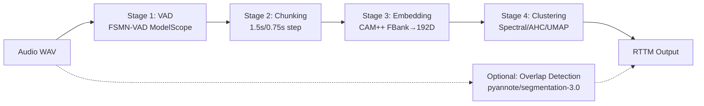
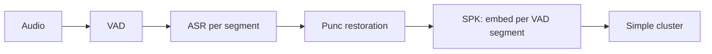
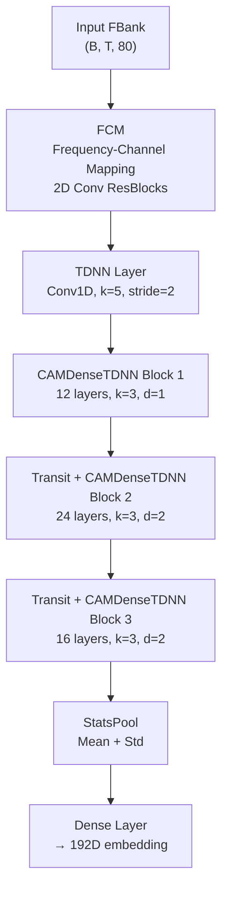

# 📊 Phân Tích 3D-Speaker → MeetingMindAI: Speaker Diarization (CAM++)

## 1. Tổng Quan Hai Repo

### 1.1 3D-Speaker (Alibaba DAMO Academy)
- **Mục đích**: Toolkit open-source cho speaker verification, recognition, và **diarization**
- **License**: Apache 2.0 — **có thể sử dụng thương mại**
- **CAM++ benchmark**: **EER 0.65%** trên VoxCeleb1-O (7.2M params) — nhẹ và chính xác
- **Diarization DER**: Tốt nhất **10.30%** trên Aishell-4, **RTF = 0.03** (nhanh gấp 6-10x so với pyannote/DiariZen)

### 1.2 MeetingMindAI (MeetASR)
- **Mục đích**: Pipeline ASR + Speaker Diarization + LLM Summarization cho cuộc họp
- **Stack hiện tại**: FunASR-based, CAM++ wrapper qua FunASR AutoModel
- **Trạng thái SPK module**: ⚠️ **Sơ khai** — wrapper mỏng, thiếu nhiều stage quan trọng

---

## 2. Kiến Trúc Diarization Pipeline So Sánh

### 2.1 3D-Speaker Pipeline (Hoàn chỉnh, 5 Stage)



**Chi tiết từng stage:**

| Stage | Module | Source Code | Key Parameters |
|-------|--------|------------|----------------|
| **VAD** | FSMN-VAD (ModelScope) | [infer_diarization.py:107-121](file:///home/anhtu/workspace/HIT/3D-Speaker/speakerlab/bin/infer_diarization.py#L107-L121) | `iic/speech_fsmn_vad_zh-cn-16k-common-pytorch` |
| **Chunking** | Sliding window | [infer_diarization.py:234-241](file:///home/anhtu/workspace/HIT/3D-Speaker/speakerlab/bin/infer_diarization.py#L234-L241) | `dur=1.5s, step=0.75s` |
| **FBank** | 80-dim Mel filterbank | [processor.py:133-158](file:///home/anhtu/workspace/HIT/3D-Speaker/speakerlab/process/processor.py#L133-L158) | `n_mels=80, sample_rate=16000, mean_nor=True` |
| **Embedding** | CAM++ (FCM + DenseTDNN) | [DTDNN.py:50-115](file:///home/anhtu/workspace/HIT/3D-Speaker/speakerlab/models/campplus/DTDNN.py#L50-L115) | `feat_dim=80, embedding_size=192` |
| **Clustering** | CommonClustering (Spectral default) | [cluster.py:161-241](file:///home/anhtu/workspace/HIT/3D-Speaker/speakerlab/process/cluster.py#L161-L241) | `spectral, mer_cos=0.8, pval=0.012` |
| **Overlap** | pyannote/segmentation-3.0 | [infer_diarization.py:123-142](file:///home/anhtu/workspace/HIT/3D-Speaker/speakerlab/bin/infer_diarization.py#L123-L142) | Optional, cần HF token |

### 2.2 MeetingMindAI Pipeline Hiện Tại (Thiếu Sót)



**Vấn đề nghiêm trọng của MeetASR SPK module:**

> [!WARNING]
> **Thiếu Sub-segmentation** — MeetASR embed trực tiếp từng VAD segment (có thể dài vài phút). 3D-Speaker chia thành sub-segments 1.5s mới embed → chính xác hơn nhiều.

> [!WARNING]
> **Thiếu Post-processing** — Không có `compressed_seg()` để merge segments liền kề, không có `filter_minor_cluster()` hay `merge_by_cos()`.

> [!WARNING]
> **Clustering yếu** — Dùng FunASR ClusterBackend thay vì hệ thống clustering mạnh mẽ của 3D-Speaker (Spectral + AHC fallback + minor filtering + cosine merging).

---

## 3. Kiến Thức Có Thể Áp Dụng Trực Tiếp

### 3.1 🎯 `Diarization3Dspeaker` Class — **ÁP DỤNG NGAY**

[infer_diarization.py:145-386](file:///home/anhtu/workspace/HIT/3D-Speaker/speakerlab/bin/infer_diarization.py#L145-L386)

Đây là class hoàn chỉnh nhất, có thể tích hợp trực tiếp:

```python
from speakerlab.bin.infer_diarization import Diarization3Dspeaker

pipeline = Diarization3Dspeaker(device='cuda')
result = pipeline(wav_path)  # [[start, end, speaker_id], ...]
```

**Cách áp dụng cho MeetASR:**
1. Thay thế `CAMPlusPlus` wrapper hiện tại bằng adapter gọi `Diarization3Dspeaker`
2. Hoặc port từng component riêng lẻ (khuyến nghị)

### 3.2 🔧 Sub-segmentation Strategy

```python
# Từ 3D-Speaker: infer_diarization.py:234-241
def chunk(self, st, ed, dur=1.5, step=0.75):
    """Chia VAD segment thành sub-segments nhỏ với overlap."""
    chunks = []
    subseg_st = st
    while subseg_st + dur < ed + step:
        subseg_ed = min(subseg_st + dur, ed)
        chunks.append([subseg_st, subseg_ed])
        subseg_st += step
    return chunks
```

> [!IMPORTANT]
> **Đây là cải tiến quan trọng nhất cần port sang MeetASR.** VAD segments dài → chia 1.5s chunks → embedding → clustering → gán speaker lại cho từng sentence.

### 3.3 🔧 FBank Feature Extraction (Bypass FunASR)

```python
# 3D-Speaker dùng Kaldi FBank trực tiếp qua torchaudio
# processor.py:133-158
class FBank:
    def __init__(self, n_mels=80, sample_rate=16000, mean_nor=True):
        ...
    def __call__(self, wav, dither=0):
        feat = Kaldi.fbank(wav, num_mel_bins=self.n_mels, 
                           sample_frequency=sr, dither=dither)
        if self.mean_nor:
            feat = feat - feat.mean(0, keepdim=True)
        return feat
```

### 3.4 🔧 Clustering Nâng Cao

[cluster.py](file:///home/anhtu/workspace/HIT/3D-Speaker/speakerlab/process/cluster.py) — **3 thuật toán + 2 post-processing**:

| Thuật toán | Khi nào dùng | Key Params |
|-----------|-------------|-----------|
| **SpectralCluster** | Mặc định, > 40 segments | `pval=0.012, max_num_spks=15` |
| **AHCluster** (AHC) | Fallback khi < 40 segments | `fix_cos_thr=0.4` |
| **UmapHdbscan** | Alternative, cần thêm deps | `n_neighbors=20, min_cluster_size=10` |

**Post-processing quan trọng:**
- `filter_minor_cluster()` — gộp cluster quá nhỏ vào cluster gần nhất
- `merge_by_cos()` — merge speakers có cosine similarity > threshold (0.8)
- `compressed_seg()` — merge segments liên tiếp cùng speaker

### 3.5 🔧 Overlap Detection (Nâng Cao)

```python
# Dùng pyannote/segmentation-3.0 cho overlap detection
# Sau đó post-process bằng Hungarian matching (scipy.optimize.linear_sum_assignment)
# infer_diarization.py:273-324
```

### 3.6 🔧 `circle_pad` — Padding Thông Minh

```python
# utils.py:232-238 — Pad audio ngắn bằng cách lặp lại (circle padding)
# Thay vì zero-pad, giữ được đặc trưng giọng nói
def circle_pad(x, target_len, dim=0):
    xlen = x.shape[dim]
    if xlen >= target_len:
        return x
    n = int(np.ceil(target_len / xlen))
    xcat = torch.cat([x for _ in range(n)], dim=dim)
    return torch.narrow(xcat, dim, 0, target_len)
```

### 3.7 🔧 Diarization + ASR Alignment

[out_transcription.py](file:///home/anhtu/workspace/HIT/3D-Speaker/egs/3dspeaker/speaker-diarization/local/out_transcription.py) — Logic gán speaker cho từng câu ASR:

```python
# match_spk: Tìm speaker có overlap lớn nhất với mỗi câu
# distribute_spk: Gán speaker ID cho từng word dựa trên overlap duration
# Merge words liên tiếp cùng speaker thành đoạn
```

> [!TIP]
> Đây chính xác là logic MeetASR cần trong `_run_spk()` — hiện tại MeetASR chỉ gán 1 speaker per VAD segment, cần gán per sentence/word.

### 3.8 🔧 Builder Pattern & Config System

[builder.py](file:///home/anhtu/workspace/HIT/3D-Speaker/speakerlab/utils/builder.py) — Dynamic import + deep build pattern:

```python
# Config sử dụng <reference> syntax cho cross-referencing
# VD: feat_dim: <fbank_dim> tự resolve từ config
build('embedding_model', config)  # Auto-instantiate từ config dict
```

MeetASR đã có `AutoModel` pattern tương tự, nhưng thiếu deep-build và reference resolution.

---

## 4. CAM++ Architecture Deep Dive

### 4.1 Kiến Trúc Mạng



### 4.2 CAMLayer — Context-Aware Masking

[layers.py:70-110](file:///home/anhtu/workspace/HIT/3D-Speaker/speakerlab/models/campplus/layers.py#L70-L110) — Đặc trưng của CAM++:

```python
class CAMLayer(nn.Module):
    """Context-Aware Masking: kết hợp local convolution + global context attention."""
    def forward(self, x):
        y = self.linear_local(x)         # Local context (conv1d)
        context = x.mean(-1, keepdim=True) + self.seg_pooling(x)  # Global + segment context
        context = self.relu(self.linear1(context))
        m = self.sigmoid(self.linear2(context))  # Attention mask
        return y * m  # Element-wise gating
```

**Ý nghĩa**: CAM++ kết hợp cả local và global context để tạo attention mask, giúp mô hình focus vào đặc trưng speaker quan trọng.

### 4.3 Pretrained Models Có Sẵn

| Model ID | Ngôn ngữ | Embedding Size | Ghi chú |
|----------|---------|---------------|---------|
| `iic/speech_campplus_sv_zh-cn_16k-common` | Trung | 192 | Common model |
| `iic/speech_campplus_sv_zh_en_16k-common_advanced` | Trung+Anh | 192 | **Khuyến nghị cho diarization** |
| `damo/speech_campplus_sv_en_voxceleb_16k` | Anh | 512 | VoxCeleb model |

> [!NOTE]
> **Cho tiếng Việt**: Hiện chưa có pretrained CAM++ cho tiếng Việt. Tuy nhiên, speaker embedding thường language-agnostic ở mức độ nhất định, model `zh_en_16k-common_advanced` có thể dùng được. Nếu cần tốt hơn, cần fine-tune trên Vietnamese speaker data.

---

## 5. Gap Analysis: MeetASR vs 3D-Speaker

| Component | MeetASR Hiện Tại | 3D-Speaker | Gap Level |
|-----------|-----------------|------------|-----------|
| **VAD** | FunASR VAD (OK) | FSMN-VAD ModelScope | 🟢 Tương đương |
| **Sub-segmentation** | ❌ Không có | 1.5s chunk / 0.75s step | 🔴 **Critical** |
| **Feature Extraction** | FunASR internal | FBank 80-dim Kaldi | 🟡 Khác implementation |
| **Speaker Embedding** | FunASR CAM++ | Native CAM++ PyTorch | 🟡 Cùng model, khác wrapper |
| **Clustering** | FunASR ClusterBackend (basic) | Spectral + AHC + UMAP + post-proc | 🔴 **Critical** |
| **Post-processing** | ❌ Không có | compressed_seg, filter_minor, merge_by_cos | 🔴 **Critical** |
| **Overlap Detection** | ❌ Không có | pyannote segmentation-3.0 | 🟡 Nice-to-have |
| **Speaker-Sentence Align** | 1 speaker per VAD segment | Per-word overlap matching | 🔴 **Critical** |
| **Multi-GPU** | ❌ | torch.multiprocessing | 🟡 Scalability |
| **Output Format** | JSON/dict | RTTM + JSON | 🟢 OK |

---

## 6. Kế Hoạch Tích Hợp (Đề Xuất)

### Phase 1: Quick Win — Dùng Trực Tiếp `Diarization3Dspeaker` 🏃
```python
# Thêm vào meetasr/models/spk/campplus_3dspeaker.py
from speakerlab.bin.infer_diarization import Diarization3Dspeaker

class CAMPlusPlus3DSpeaker(AbsSpk):
    def __init__(self, device='cpu', include_overlap=False, ...):
        self.pipeline = Diarization3Dspeaker(device=device, ...)
    
    def diarize(self, audio_path) -> list:
        return self.pipeline(audio_path)
```

### Phase 2: Port Native Components 🔧
1. Port `FBank` → `meetasr/frontends/fbank.py`
2. Port `CAMPPlus` model + pretrained weights → `meetasr/models/spk/campplus_native.py`
3. Port `CommonClustering` + `SpectralCluster` + `AHCluster` → `meetasr/models/spk/clustering.py`
4. Port `compressed_seg`, `filter_minor_cluster`, `merge_by_cos` → `meetasr/utils/diarization.py`

### Phase 3: Tích Hợp Sâu 🎯
1. Implement sub-segmentation trong `MeetPipeline._run_spk()`
2. Port `distribute_spk()` logic cho speaker-sentence alignment
3. Optional: Overlap detection với pyannote
4. Cải thiện `AbsSpk` interface thêm method `diarize()` (full pipeline)

---

## 7. Từ Khóa Tìm Kiếm Hữu Ích

### Học thuật / Paper
| Keyword | Mục đích |
|---------|---------|
| `CAM++ speaker verification` | Paper gốc của model |
| `speaker diarization spectral clustering` | Thuật toán clustering chính |
| `overlap-aware speaker diarization` | Xử lý overlapping speech |
| `TDNN speaker embedding` | Kiến trúc nền tảng |
| `DenseTDNN x-vector` | Dense connection trong speaker model |
| `context-aware masking attention` | Cơ chế CAM |
| `agglomerative hierarchical clustering speaker` | AHC trong diarization |
| `UMAP HDBSCAN speaker diarization community detection` | Paper: Reformulating Speaker Diarization as Community Detection |
| `pyannote segmentation overlap detection` | Module overlap detection |
| `FSMN VAD voice activity detection` | VAD model |

### Code / Implementation
| Keyword | Mục đích |
|---------|---------|
| `3D-Speaker speakerlab infer_diarization` | Script inference chính |
| `Diarization3Dspeaker python` | Class diarization all-in-one |
| `speakerlab campplus DTDNN` | CAM++ model source |
| `modelscope speech_campplus_sv` | Pretrained model trên ModelScope |
| `spectral clustering eigengap` | Auto-detect số speaker |
| `RTTM format speaker diarization` | Format output chuẩn |
| `funasr campplus speaker embedding` | FunASR integration |
| `speaker embedding cosine similarity clustering` | Metric cho clustering |
| `pyannote.audio segmentation-3.0` | Overlap detection model |

### Datasets
| Keyword | Mục đích |
|---------|---------|
| `AliMeeting dataset speaker diarization` | Chinese meeting dataset |
| `Aishell-4 multi-speaker` | Chinese multi-speaker benchmark |
| `VoxCeleb speaker verification` | English speaker dataset |
| `3D-Speaker dataset download` | Multi-modal speaker dataset |

---

## 8. Các File Hữu Ích Nhất (Quick Reference)

### Từ 3D-Speaker

| File | Nội dung | Ưu tiên |
|------|---------|---------|
| [infer_diarization.py](file:///home/anhtu/workspace/HIT/3D-Speaker/speakerlab/bin/infer_diarization.py) | **Full diarization pipeline** — Class Diarization3Dspeaker | ⭐⭐⭐ |
| [cluster.py](file:///home/anhtu/workspace/HIT/3D-Speaker/speakerlab/process/cluster.py) | **Clustering algorithms** — Spectral, AHC, UMAP+HDBSCAN | ⭐⭐⭐ |
| [DTDNN.py](file:///home/anhtu/workspace/HIT/3D-Speaker/speakerlab/models/campplus/DTDNN.py) | CAM++ model architecture | ⭐⭐ |
| [layers.py](file:///home/anhtu/workspace/HIT/3D-Speaker/speakerlab/models/campplus/layers.py) | CAMLayer, DenseTDNN, StatsPool layers | ⭐⭐ |
| [processor.py](file:///home/anhtu/workspace/HIT/3D-Speaker/speakerlab/process/processor.py) | FBank feature extraction | ⭐⭐ |
| [out_transcription.py](file:///home/anhtu/workspace/HIT/3D-Speaker/egs/3dspeaker/speaker-diarization/local/out_transcription.py) | **Diarization + ASR alignment** logic | ⭐⭐⭐ |
| [diar.yaml](file:///home/anhtu/workspace/HIT/3D-Speaker/egs/3dspeaker/speaker-diarization/conf/diar.yaml) | Diarization config (hyperparameters) | ⭐⭐ |
| [builder.py](file:///home/anhtu/workspace/HIT/3D-Speaker/speakerlab/utils/builder.py) | Dynamic import + deep build pattern | ⭐ |
| [fileio.py](file:///home/anhtu/workspace/HIT/3D-Speaker/speakerlab/utils/fileio.py) | Audio loading + resampling utilities | ⭐ |
| [run_audio.sh](file:///home/anhtu/workspace/HIT/3D-Speaker/egs/3dspeaker/speaker-diarization/run_audio.sh) | Full diarization recipe (7 stages) | ⭐⭐ |

### Từ MeetingMindAI (cần cải thiện)

| File | Vấn đề |
|------|--------|
| [campplus.py](file:///home/anhtu/workspace/HIT/MeetingMindAI/meetasr/models/spk/campplus.py) | Wrapper quá mỏng, thiếu sub-segmentation & post-processing |
| [pipeline.py _run_spk](file:///home/anhtu/workspace/HIT/MeetingMindAI/meetasr/pipeline.py#L200-L232) | Embed per VAD segment (sai), không có chunking |
| [abs_models.py AbsSpk](file:///home/anhtu/workspace/HIT/MeetingMindAI/meetasr/models/abs_models.py#L63-L77) | Interface chỉ có `embed()`, thiếu `diarize()` full pipeline |

---

## 9. Hyperparameters Quan Trọng

```yaml
# Từ 3D-Speaker diar.yaml — các giá trị đã được tune
fbank_dim: 80
embedding_size: 192
sample_rate: 16000

# Sub-segmentation
chunk_duration: 1.5  # seconds
chunk_step: 0.75     # seconds (50% overlap)

# Spectral Clustering
cluster_type: spectral
mer_cos: 0.8         # Cosine threshold để merge speakers tương tự
min_num_spks: 1
max_num_spks: 15
min_cluster_size: 4  # Minimum segments per cluster
pval: 0.012          # p-pruning threshold cho affinity matrix

# AHC (fallback khi < 40 segments)
ahc_fix_cos_thr: 0.4

# Batch processing
embedding_batch_size: 64
```

---

## 10. Dependencies Cần Thêm

```txt
# Cho Phase 1 (dùng Diarization3Dspeaker trực tiếp)
modelscope>=1.0.0
pyannote.audio          # Nếu cần overlap detection
fastcluster>=1.2.6
umap-learn
hdbscan

# Cho Phase 2 (port native)
torchaudio              # Đã có
scipy                   # Đã có
scikit-learn            # Đã có
numpy                   # Đã có
```

---

## 11. Kết Luận & Khuyến Nghị

> [!IMPORTANT]
> **Khuyến nghị chính**: 3D-Speaker cung cấp một pipeline diarization hoàn chỉnh, production-ready mà MeetASR đang thiếu nghiêm trọng. **4 cải tiến critical** cần làm ngay:
> 1. **Sub-segmentation** (chunking 1.5s) trước khi embed
> 2. **Port clustering nâng cao** (Spectral + AHC fallback + post-processing)
> 3. **Speaker-sentence alignment** (per-word overlap matching thay vì per-segment)
> 4. **Post-processing** (compressed_seg + filter_minor + merge_by_cos)

**Cách tiếp cận nhanh nhất**: Import `Diarization3Dspeaker` trực tiếp (Phase 1), sau đó dần port từng component để giảm dependency và tùy biến (Phase 2-3).
