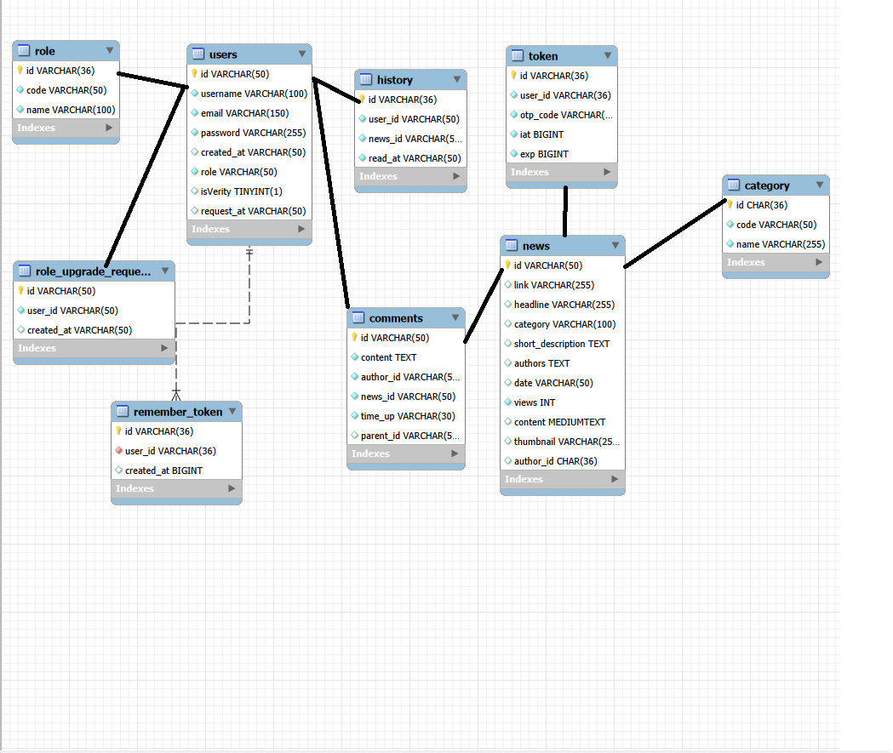

# 📰 NewsWeb – Ứng dụng Đọc Báo Desktop

> Bài tập lớn môn **Lập trình Java** – Ứng dụng đọc và quản lý tin tức được xây dựng bằng **JavaFX** kết hợp **MySQL**.

---

## 📋 Mục lục

- [Giới thiệu](#-giới-thiệu)
- [Tính năng](#-tính-năng)
- [Công nghệ sử dụng](#-công-nghệ-sử-dụng)
- [Cấu trúc dự án](#-cấu-trúc-dự-án)
- [ERD – Sơ đồ cơ sở dữ liệu](#-erd--sơ-đồ-cơ-sở-dữ-liệu)
- [Cài đặt & Chạy](#-cài-đặt--chạy)
- [Cấu hình môi trường](#-cấu-hình-môi-trường)
- [Thành viên](#-thành-viên)

---

## 📖 Giới thiệu

**NewsWeb** là ứng dụng desktop cho phép người dùng đọc tin tức, tìm kiếm theo từ khóa, lọc theo danh mục, bình luận và quản lý bài viết của riêng mình. Ứng dụng được xây dựng theo mô hình **MVC (Model–View–Controller)**, sử dụng **JavaFX** cho giao diện và **MySQL** làm hệ quản trị cơ sở dữ liệu thông qua **JDBC**.

Dữ liệu ban đầu được nhập từ bộ dataset JSON chứa hàng nghìn bài báo thực tế, sau đó được lưu và quản lý trong database.

---

## ✨ Tính năng

### 👤 Tài khoản & Xác thực
- Đăng ký tài khoản, xác thực email qua **OTP**
- Đăng nhập / Đăng xuất
- **Ghi nhớ đăng nhập** (Remember Me) bằng token
- Quên mật khẩu: nhập username + email → nhận OTP → đặt lại mật khẩu

### 🏠 Trang chủ
- Hiển thị danh sách tin tức dạng **ListView** (tiêu đề, ảnh thumbnail, mô tả ngắn, ngày đăng, lượt xem)
- **4 chế độ xem:**
  - 🔮 **Gợi ý (Recommend):** cá nhân hóa dựa trên lịch sử đọc
  - 🆕 **Mới nhất (New):** sắp xếp theo ngày, có phân trang
  - 🔥 **Hot (Hot):** sắp xếp theo lượt xem, có phân trang
  - 🗂️ **Theo danh mục (Category):** lọc theo thể loại
- **Tìm kiếm** toàn văn bản (Full-text search)
- **Phân trang** trong chế độ New / Hot / Category

### 📰 Chi tiết bài viết
- Xem toàn bộ nội dung bài, ảnh thumbnail, danh mục, ngày đăng
- **Tăng lượt xem** mỗi khi mở bài
- **Bình luận** (cần đăng nhập): gửi bình luận, xem/ẩn bình luận con (reply), xóa bình luận
- **Trả lời bình luận** lồng nhau (nested comments)

### 👤 Trang cá nhân (Profile)
- Xem thông tin tài khoản: username, email, vai trò
- **Đổi avatar** (upload ảnh từ máy tính)
- Xem danh sách bài viết đã đăng
- Tìm kiếm bài viết của bản thân
- **Tạo bài viết mới** (Journalist / Admin)
- **Chỉnh sửa bài viết:** tiêu đề, tóm tắt, nội dung, danh mục, ảnh thumbnail

### 🔐 Phân quyền (Role-based)
| Quyền      | Xem báo | Bình luận | Đăng bài | Duyệt yêu cầu |
|------------|---------|-----------|----------|----------------|
| USER       | ✅      | ✅        | ❌       | ❌             |
| JOURNALIST | ✅      | ✅        | ✅       | ❌             |
| ADMIN      | ✅      | ✅        | ✅       | ✅             |

- **User** có thể gửi yêu cầu nâng cấp lên **Journalist**
- **Admin** xem danh sách yêu cầu và duyệt cấp quyền

### 🤖 Hệ thống gợi ý tin tức (Recommend Engine)
Thuật toán gợi ý dựa trên:
1. **Lịch sử đọc bài** của người dùng (20 bài gần nhất)
2. **Trọng số danh mục** (category weight) từ lịch sử
3. **Điểm số bài báo** = `category_weight × 0.8 + freshness × 0.2`
4. **70% bài được cá nhân hóa**, 30% còn lại chọn ngẫu nhiên

Nếu chưa đăng nhập hoặc chưa có lịch sử, hệ thống hiển thị **10 bài mới nhất**.

---

## 🛠️ Công nghệ sử dụng

| Thành phần        | Công nghệ                            |
|-------------------|--------------------------------------|
| Ngôn ngữ          | Java 21                              |
| Giao diện         | JavaFX 17.0.8 (FXML)                 |
| Cơ sở dữ liệu     | MySQL 8                              |
| Kết nối DB        | JDBC (`mysql-connector-j 8.0.33`)    |
| Đọc file `.env`   | `dotenv-java 3.0.0`                  |
| Đọc JSON          | `Gson 2.10.1`                        |
| Mã hóa mật khẩu   | `jBCrypt 0.4`                        |
| Xử lý chuỗi       | `Apache Commons Lang3 3.14.0`        |
| Gửi email (OTP)   | `Jakarta Mail 2.0.1`                 |
| Build tool        | Maven                                |

---

## 📂 Cấu trúc dự án

```
BTL_Java_Private/
├── NewsWeb/
│   ├── .env                         # Cấu hình môi trường (DB, admin mặc định)
│   ├── pom.xml                      # Cấu hình Maven
│   ├── src/
│   │   └── main/
│   │       ├── java/org/example/
│   │       │   ├── MainApp.java         # Điểm vào ứng dụng
│   │       │   ├── RunFX/               # Launcher JavaFX
│   │       │   ├── controller/          # Xử lý giao diện (MVC Controller)
│   │       │   │   ├── HomeController.java
│   │       │   │   ├── NewsDetailController.java
│   │       │   │   ├── ProfileController.java
│   │       │   │   ├── LoginController.java
│   │       │   │   ├── RegisterController.java
│   │       │   │   ├── ForgotPasswordController.java
│   │       │   │   └── VerifyController.java
│   │       │   ├── dao/                 # Data Access Object – truy vấn DB
│   │       │   │   ├── NewsDAO.java
│   │       │   │   ├── AuthDAO.java
│   │       │   │   ├── UserDAO.java
│   │       │   │   ├── CommentDAO.java
│   │       │   │   ├── HistoryDAO.java
│   │       │   │   ├── CategoryDAO.java
│   │       │   │   ├── RequestUpRoleDAO.java
│   │       │   │   └── DBConnection.java
│   │       │   ├── dto/                 # Data Transfer Objects
│   │       │   │   ├── NewsDTO.java
│   │       │   │   ├── UserDTO.java
│   │       │   │   ├── CommentDTO.java
│   │       │   │   ├── CategoryDTO.java
│   │       │   │   └── RoleDTO.java
│   │       │   ├── entity/              # Entity (ánh xạ bảng DB)
│   │       │   │   ├── News.java
│   │       │   │   ├── User.java
│   │       │   │   ├── Comments.java
│   │       │   │   ├── History.java
│   │       │   │   ├── Category.java
│   │       │   │   ├── Role.java
│   │       │   │   ├── Token.java
│   │       │   │   ├── RememberAuth.java
│   │       │   │   └── RoleUpgradeRequest.java
│   │       │   ├── service/             # Business Logic (Interface + Impl)
│   │       │   │   ├── HomeService.java / Impl/HomeServiceimpl.java
│   │       │   │   ├── LoginService.java / Impl/LoginServiceImpl.java
│   │       │   │   ├── RegisterService.java / Impl/RegisterServiceImpl.java
│   │       │   │   ├── ProfileService.java / Impl/ProfileServiceImpl.java
│   │       │   │   ├── CommendService.java / Impl/CommentServiceImpl.java
│   │       │   │   ├── RecommendService.java / Impl/RecommendServiceImpl.java
│   │       │   │   ├── NewsService.java / Impl/NewsServiceImpl.java
│   │       │   │   ├── HistoryService.java / Impl/HistoryServiceImpl.java
│   │       │   │   ├── UpNewsService.java / Impl/UpNewsServiceImpl.java
│   │       │   │   ├── EditNewsService.java / Impl/EditNewsServiceImpl.java
│   │       │   │   ├── UpgradeRole.java / Impl/UpgradeRoleImpl.java
│   │       │   │   └── UserSevice.java / Impl/UserServiceImpl.java
│   │       │   ├── utils/               # Tiện ích
│   │       │   │   ├── EmailUtils.java      # Gửi email OTP
│   │       │   │   ├── PasswordUtils.java   # Mã hóa & kiểm tra mật khẩu
│   │       │   │   ├── GenerateOtp.java     # Tạo mã OTP 6 chữ số
│   │       │   │   ├── RememberToken.java   # Xử lý Remember Me
│   │       │   │   ├── TextUtils.java       # Xử lý chuỗi
│   │       │   │   ├── CheckNullUtils.java  # Kiểm tra null
│   │       │   │   └── WeightRandom.java    # Random có trọng số
│   │       │   └── DB/                  # Import dữ liệu khởi tạo
│   │       │       ├── ImportNewsFromDataset.java
│   │       │       ├── ImportCategory.java
│   │       │       ├── CreateAdminAccount.java
│   │       │       └── CheckImport.java
│   │       └── resources/
│   │           ├── ERD.png                  # Sơ đồ ERD
│   │           ├── Homepage/                # FXML trang chủ
│   │           ├── Login/                   # FXML đăng nhập
│   │           ├── Register/                # FXML đăng ký + xác thực
│   │           ├── ForgotPassword/          # FXML quên mật khẩu
│   │           ├── NewsDetail/              # FXML chi tiết bài viết
│   │           ├── Profile/                 # FXML trang cá nhân
│   │           ├── Image/                   # Ảnh mặc định
│   │           └── Data/                    # Dữ liệu khởi tạo / JSON
│   └── user-data/                       # Ảnh người dùng (avatar, ảnh bài viết)
├── create table.txt                     # Script SQL tạo bảng
└── Tasks.txt                            # Danh sách tính năng cần làm
```

---

## 🗃️ ERD – Sơ đồ cơ sở dữ liệu



### Mô tả các bảng chính

| Bảng                  | Mô tả                                                    |
|-----------------------|----------------------------------------------------------|
| `user`                | Lưu thông tin người dùng (username, email, password hash, role, trạng thái xác thực) |
| `news`                | Lưu bài viết (tiêu đề, nội dung, tóm tắt, danh mục, lượt xem, tác giả, ngày đăng) |
| `category`            | Danh mục bài viết (code, name)                           |
| `role`                | Vai trò hệ thống (admin, journalist, user)               |
| `comment`             | Bình luận bài viết, hỗ trợ **lồng nhau** (parent_id)    |
| `history`             | Lịch sử đọc bài (user_id, news_id, thời gian đọc)       |
| `token`               | OTP token dùng cho xác thực email / quên mật khẩu       |
| `remember_token`      | Token ghi nhớ đăng nhập (Remember Me)                    |
| `role_upgrade_requests` | Yêu cầu nâng quyền từ User lên Journalist             |

### Quan hệ chính

```
user      ──(1:N)──> news               (author_id)
user      ──(1:N)──> comment            (author_id)
user      ──(1:N)──> history            (user_id)
user      ──(1:N)──> token              (user_id)
user      ──(1:N)──> remember_token     (user_id)
user      ──(1:N)──> role_upgrade_requests (user_id)
news      ──(N:1)──> category           (category code)
news      ──(1:N)──> comment            (news_id)
news      ──(1:N)──> history            (news_id)
comment   ──(1:N)──> comment            (parent_id, tự tham chiếu)
```

---

## 🚀 Cài đặt & Chạy

### Yêu cầu hệ thống

- **Java 21+**
- **Maven 3.8+**
- **MySQL 8+**

### 1. Clone dự án

```bash
git clone <https://github.com/khanh19042006/BTL_Java_News.git>
cd BTL_Java_Private/NewsWeb
```

### 2. Tạo database MySQL

```sql
CREATE DATABASE news_project_db CHARACTER SET utf8mb4 COLLATE utf8mb4_unicode_ci;
```

Sau đó chạy lần lượt các câu lệnh trong file [`create table.txt`](create%20table.txt) để tạo các bảng.

### 3. Cấu hình file `.env`

Chỉnh sửa file `NewsWeb/.env` theo thông tin MySQL của bạn:

```env
DB_URL=jdbc:mysql://localhost:3306/news_project_db
DB_USER=root
DB_PASSWORD=your_password
DB_JSON_URL=src/main/resources/News_Category_Dataset_v3.json

ADMIN_USERNAME=admin
ADMIN_EMAIL=admin@gmail.com
ADMIN_PASSWORD=123456
ADMIN_ROLE=admin
ADMIN_CREATED_AT=2026-02-01
ADMIN_IS_VERIFIED=true
ADMIN_ID=c505cc32-1ea9-47a2-b936-327aaf483dbc
```

### 4. Import dữ liệu ban đầu

Khi chạy lần đầu, ứng dụng sẽ **tự động**:
- Tạo tài khoản admin mặc định
- Import danh mục từ JSON
- Import dữ liệu bài viết từ `News_Category_Dataset_v3.json`

### 5. Chạy ứng dụng

```bash
mvn javafx:run
```

hoặc build và chạy:

```bash
mvn clean package
mvn javafx:run
```

---

## ⚙️ Cấu hình môi trường

| Biến                 | Mô tả                                  |
|----------------------|----------------------------------------|
| `DB_URL`             | JDBC URL kết nối MySQL                 |
| `DB_USER`            | Username MySQL                         |
| `DB_PASSWORD`        | Password MySQL                         |
| `DB_JSON_URL`        | Đường dẫn file JSON chứa dataset       |
| `ADMIN_USERNAME`     | Username tài khoản admin mặc định      |
| `ADMIN_EMAIL`        | Email tài khoản admin mặc định         |
| `ADMIN_PASSWORD`     | Mật khẩu admin mặc định                |
| `ADMIN_ID`           | UUID cố định của tài khoản admin       |

---

## 🏗️ Kiến trúc hệ thống

```
┌─────────────────────────────────────────────────────┐
│                   JavaFX UI (FXML)                  │
│  Homepage | Login | Register | Profile | NewsDetail  │
└────────────────────┬────────────────────────────────┘
                     │
┌────────────────────▼────────────────────────────────┐
│               Controller Layer                       │
│  HomeController | LoginController | ProfileController│
│  NewsDetailController | RegisterController | ...     │
└────────────────────┬────────────────────────────────┘
                     │
┌────────────────────▼────────────────────────────────┐
│               Service Layer (Business Logic)         │
│  HomeService | LoginService | RecommendService | ... │
└────────────────────┬────────────────────────────────┘
                     │
┌────────────────────▼────────────────────────────────┐
│               DAO Layer (Data Access)                │
│  NewsDAO | AuthDAO | CommentDAO | HistoryDAO | ...   │
└────────────────────┬────────────────────────────────┘
                     │
              ┌──────▼──────┐
              │   MySQL DB   │
              └─────────────┘
```

---

## 👨‍💻 Thành viên

| Thành viên            | Vai trò                          |
|-----------------------|----------------------------------|
| Nguyễn Đình Duy Khánh | Backend & Cơ sở dữ liệu (MySQL)  |
| Nguyễn Đình Hoàng     | Frontend (JavaFX / FXML)         |

---

> 📅 Thực hiện tháng 02/2026 – HIT (Hanoi Information Technology club)
